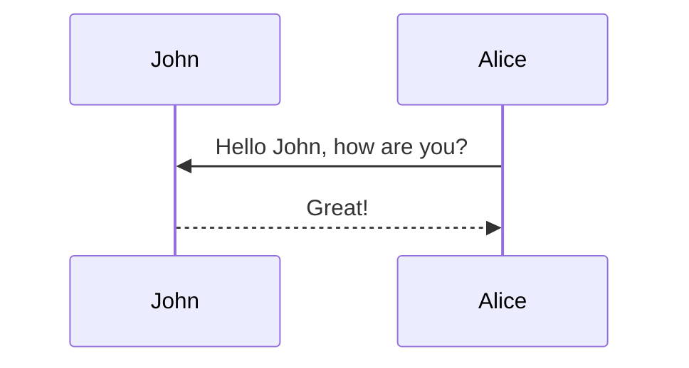

This theme supports generating various diagrams from a text description using [mermaid](https://mermaid-js.github.io/mermaid/){:target="\_blank"}. Previously, this was done using the [jekyll-diagrams](https://github.com/zhustec/jekyll-diagrams){:target="\_blank"} plugin. For more information on this matter, see the [related issue](https://github.com/alshedivat/al-folio/issues/1609#issuecomment-1656995674).

To enable mermaid, you have to put the following in this post frontmatter:

```yml
mermaid:
  enabled: true
  zoomable: true
```

To disable the zooming feature, set `mermaid: zoomable` to `false`.

## Mermaid

The diagram below was generated by the following code:

````markdown

````


